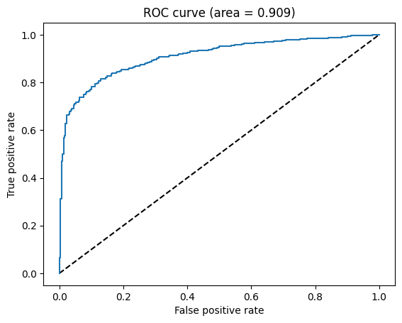

# Chest X-ray Classifier

Binary classification of chest radiographs, NORMAL against PNEUMONIA, using
EfficientNetB2 pretrained on ImageNet with the first 74 layers frozen and a small
dense head fine-tuned on top.



## Requirements

Python 3.10 or later, and the
[chest-xray-pneumonia](https://www.kaggle.com/datasets/paultimothymooney/chest-xray-pneumonia)
dataset from Kaggle, downloaded and unzipped locally.

## Installation

```bash
pip install -e .
```

With the test suite:

```bash
pip install -e ".[dev]"
```

## Usage

```python
from chest_xray import build_model, evaluate, load_images, stratified_splits

images, labels, names = load_images("chest_xray/")
splits = stratified_splits(images, labels)

model = build_model()
model.fit(*splits["train"], validation_data=splits["validation"], epochs=20)

x_test, y_test = splits["test"]
print(evaluate(y_test, model.predict(x_test), names).report)
```

`evaluate` selects the ROC-optimal threshold by default. Pass `threshold=0.5` to
score at the conventional cut instead.

## Results

1,171 held-out images, 316 normal and 855 pneumonia, at the default 0.5
threshold.

| | precision | recall | f1 | support |
| --- | --- | --- | --- | --- |
| NORMAL | 0.62 | 0.88 | 0.73 | 316 |
| PNEUMONIA | 0.95 | 0.80 | 0.87 | 855 |
| accuracy | | | 0.82 | 1,171 |

ROC AUC is 0.909, and the distance between that and the 0.82 accuracy is the
useful part. An AUC of 0.909 says the model ranks a random pneumonia case above a
random normal one about nine times in ten, so the representation separates the
classes well. The accuracy says the threshold is placed badly for this data.

Cutting at 0.5 is correct only when classes are balanced and both error types
cost the same. Neither holds: pneumonia outnumbers normal 2.7 to 1, and a missed
pneumonia is not interchangeable with a false alarm. At that threshold the model
misses 20% of pneumonia cases while raising a false alarm on nearly four in ten
of the images it calls normal. `best_threshold()` picks the point maximising
sensitivity plus specificity, and the AUC says there is room to trade precision
for recall.

The ROC curve and confusion matrix are in `docs/`.

## Approach

**Splitting.** The published validation split is sixteen images, too few to
select on, so all three directories are pooled and re-split 60/20/20 with
stratification, preserving the class ratio in each.

**Imbalance.** Balanced class weights during training rather than resampling, so
no image is duplicated or discarded.

**Augmentation.** Geometric only: horizontal flip, ±30° rotation, 20% shift and
zoom. No vertical flip, since an upside-down radiograph is not something anyone
is asked to read, and no brightness jitter, since that alters the tissue contrast
the model needs.

**Schedule.** Adam with piecewise-constant decay, 1e-5 falling to 1e-6 across 20
epochs, kept low because most of the backbone is frozen and the head is small.

## Project structure

```
chest_xray/
    data.py       loading, class ordering, stratified splits
    model.py      EfficientNetB2 backbone, classification head, augmentation
    evaluate.py   metrics and ROC-optimal thresholding
tests/            splitting, thresholding and model wiring tests
docs/             figures referenced by this README
pyproject.toml    dependencies
```

## Components

| module | responsibility |
| --- | --- |
| `data` | Reads the image tree, fixes class ordering, produces the three splits |
| `model` | Builds and compiles the network, and the augmentation pipeline |
| `evaluate` | Threshold selection, accuracy, per-class report, confusion matrix |

## Testing

```bash
python -m pytest tests/
```

Seven tests covering class ordering, image dtype and range, split disjointness
and class balance, threshold selection, and model output shape. The model test
builds the network without pretrained weights, so nothing is downloaded.
